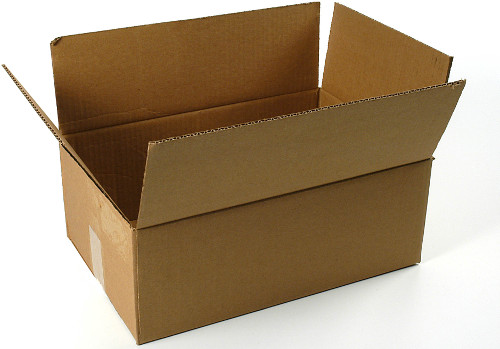
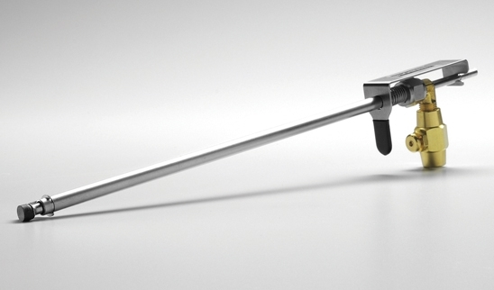
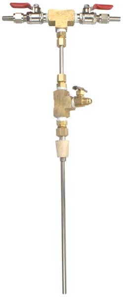

### Case Studies in
## Simple Design

  

#### presented by Andrew Dona-Couch
#### 2018-Q1 Engineering All Hands

> Any intelligent fool can make things bigger, more complex and more violent. It takes a touch of genius and a lot of courage to move in the opposite direction.

>   —Albert Einstein

<small>As quoted in Chapter 9 of _The Art of Agile Development_.</small>

### Agenda

- A short simple design primer.
- The case studies:
  - Bankers Box
  - Blichmann Beer Gun
- A brief review.

Note:
- short introduction
- bulk of the time reviewing
  - examples of consumer products
  - why simple?
- generalize

---

### Simple Design

- The Goal
- Necessary Context
- Dimensions of Simplicity
- Application Notes
- Some Caveats

### The Goal

- To make our systems:
  - Easier to understand,
  - Easier to use, and
  - Easier to change.

### Necessary Context

- CI/CD
- Confidence in Testing
- Refactor Mercilessly

Note:
- works best in cicd environment
  - always a potentially shippable product
- make changes without fear
- habit of refactoring
  - supple design

### Dimensions of Simplicity

- Interface vs. implementation
- How to measure simplicity?
- Others?

Note:
- interface vs. implementation
  - sometimes seen at odds, e.g. if interface too:
    - opaque - just hides the complexity
    - porous - exposes the complexity
  - too much responsibility on one group or the other
  - local/global maxima
- measurement:
  - files/classes/methods/lines
  - cyclomatic complexity
  - conceptual weight?

### Application Notes

- DTSTTCPW.
- YAGNI!
- Once and only once.
- Incidental vs. essential complexity.

Note:
- rule of thumb: do the simplest thing that could possible work
- you can't predict the future, and even if you really do need something:
  - you won't pay maintenance cost on something you're not using
  - you'll learn in the meantime and do it better then
- give every concept a home
- eliminate incidental to illustrate essential

### Some Caveats

- Simple doesn't mean simplistic.
- Requires careful thought.
- Fail fast.

Note:
- no boneheaded decisions just to
  - save a few lines
  - or get it done faster
- complex is actually easier to do
- design is intentionally incomplete 

---

### And now,

## The Case Studies

---

## Bankers Box

### Bankers Box

- For file storage & transport.
- Assembles without tape.
- Very sturdy, especially the bottom.
- Has handles!
- Lid is completely removable.

### Compare to:

Note:
- requires tape
- with full load, can give in the middle
- sometimes handles, but they diminish integrity
- flaps get in the way

---

## Blichmann Beer Gun

### Blichmann Beer Gun

- For filling bottles of keg beer.
- Low foaming, oxygen-free filling.
- Quick, one-handed operation.
- Totally disassembles for cleaning.

### Compare to:

Note:
- why does it have three valves?
- beer valve on top (spillage and foam!)
- two (or three) handed operation

---

### What makes a
### design _simple_?

- Fitness for purpose.
- Easy to use.
- Minimum number of elements.

Note:
- do one thing and do it well
- learnable & effective
- can't remove a part without impacting the above

> Perfection is achieved, not when there is nothing more to add, but when there is nothing left to take away.

>   —Antoine de Saint-Exupéry

### Thank you!

  

### Any thoughts/questions?

---

## References

- [_The Art of Agile Development_](http://www.jamesshore.com/Agile-Book/), Shore & Warden
  - Chapter 9 - Developing
- _Domain-Driven Design_, Eric Evans
  - Chapter 10 - Supple Design
- _The Mythical Man-Month_, Fred Brooks
  - Chapter 16 - No Silver Bullet
- Many pages on Ward's Wiki: [wiki.c2.com](http://wiki.c2.com)
